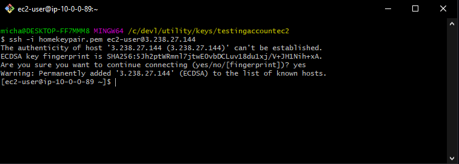
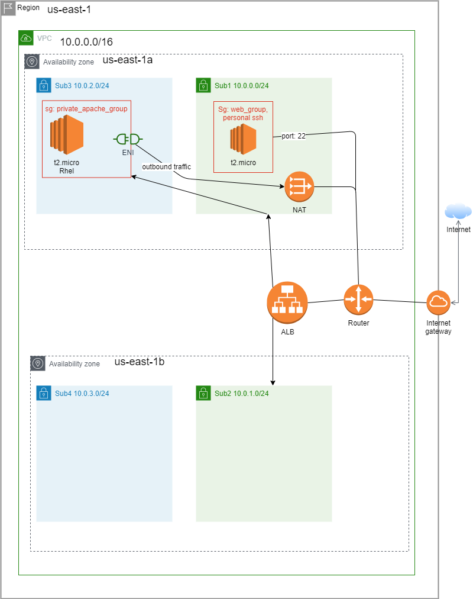

# coalfireinterviewprivate
coalfireinterview

Broken Parts

Creating a healthy target for the ALB to point to. Currently when the ec2 in Sub3 starts up it does not come up correctly and does not start an apache server. The user data for the EC2 were my steps to get apache running on a machine when signing in myself. My thoughts on the error and what I tried to debug was that I did not register the NAT gateway correctly and the ec2 cannot reach out to the internet to download apache on the command of "yum install httpd -y". So without apache running correctly the ALB never gets a healthy target registered to the target group. 

Assumptions
- AWS account already exist. This terraform provisions a vpc with subnets but not a new AWS account
- keypair - homekeypair is already created inside the console.
- Redhat AMI - ami-096fda3c22c1c990a can be a trusted redhat AMI
- Credentials - loaded locally from aws config for this project
- Non locked terraform version - for the short nature of this I didn't version lock my version of terraform
- Instance assumptions
    - 20 GB of storage is on the root device and okay to be ephemal. Instead of creating an EBS volume and attaching it everytime
- SSH / SSM
    - If I had more time I would have opted for ssm to the ec2 in the Sub1 subnet. Avoiding having to open up port 22 at all. To cover for having to open up port 22 I have it cidr ranged to my personal IP. (/32)

Sources used
## Sources

[https://registry.terraform.io/modules/terraform-aws-modules/vpc/aws/2.21.0?tab=resources](https://registry.terraform.io/modules/terraform-aws-modules/vpc/aws/2.21.0?tab=resources)

[https://www.terraform.io/docs/index.html](https://www.terraform.io/docs/index.html)

[https://registry.terraform.io/providers/hashicorp/aws/latest/docs](https://registry.terraform.io/providers/hashicorp/aws/latest/docs)

[https://registry.terraform.io/providers/hashicorp/aws/latest/docs/resources/subnet](https://registry.terraform.io/providers/hashicorp/aws/latest/docs/resources/subnet)

[https://registry.terraform.io/providers/hashicorp/aws/latest/docs/resources/nat_gateway](https://registry.terraform.io/providers/hashicorp/aws/latest/docs/resources/nat_gateway#subnet_id)

[https://registry.terraform.io/providers/hashicorp/aws/latest/docs/resources/eip](https://registry.terraform.io/providers/hashicorp/aws/latest/docs/resources/eip)

[https://aws.amazon.com/premiumsupport/knowledge-center/nat-gateway-vpc-private-subnet/](https://aws.amazon.com/premiumsupport/knowledge-center/nat-gateway-vpc-private-subnet/)  # reference to confirm NAT Gateway location order

[https://registry.terraform.io/providers/hashicorp/aws/latest/docs/resources/nat_gateway#allocation_id](https://registry.terraform.io/providers/hashicorp/aws/latest/docs/resources/nat_gateway#allocation_id)

[https://docs.aws.amazon.com/cloudhsm/latest/userguide/create-subnets.html](https://docs.aws.amazon.com/cloudhsm/latest/userguide/create-subnets.html)

[https://docs.aws.amazon.com/vpc/latest/userguide/VPC_Route_Tables.html](https://docs.aws.amazon.com/vpc/latest/userguide/VPC_Route_Tables.html)

1. [https://docs.aws.amazon.com/vpc/latest/userguide/VPC_Scenario2.html](https://docs.aws.amazon.com/vpc/latest/userguide/VPC_Scenario2.html) - Routing tables /

[https://registry.terraform.io/providers/hashicorp/aws/latest/docs/resources/route_table](https://registry.terraform.io/providers/hashicorp/aws/latest/docs/resources/route_table)

[https://registry.terraform.io/providers/hashicorp/aws/latest/docs/resources/route_table_association](https://registry.terraform.io/providers/hashicorp/aws/latest/docs/resources/route_table_association)

[https://registry.terraform.io/providers/hashicorp/aws/latest/docs/resources/route](https://registry.terraform.io/providers/hashicorp/aws/latest/docs/resources/route)

[https://registry.terraform.io/providers/hashicorp/aws/latest/docs/resources/instance#security_groups](https://registry.terraform.io/providers/hashicorp/aws/latest/docs/resources/instance#security_groups)

[https://registry.terraform.io/providers/hashicorp/aws/latest/docs/resources/security_group](https://registry.terraform.io/providers/hashicorp/aws/latest/docs/resources/security_group)

[https://github.com/hashicorp/terraform/issues/14445](https://github.com/hashicorp/terraform/issues/14445) - Random issue page that had an example of how to block out root_block_device for aws_instance

[https://registry.terraform.io/providers/hashicorp/aws/latest/docs/resources/lb](https://registry.terraform.io/providers/hashicorp/aws/latest/docs/resources/lb)

[https://registry.terraform.io/providers/hashicorp/aws/latest/docs/resources/lb_listener](https://registry.terraform.io/providers/hashicorp/aws/latest/docs/resources/lb_listener)

[https://gist.github.com/herrera-ignacio/4d91ae564364f9120720f6bf029b9412](https://gist.github.com/herrera-ignacio/4d91ae564364f9120720f6bf029b9412) - installing apache using shell and user data. I plan on using user data for the install

[https://www.bogotobogo.com/DevOps/Terraform/Terraform-terraform-userdata.php](https://www.bogotobogo.com/DevOps/Terraform/Terraform-terraform-userdata.php) - planning to leverage the file option of this after the mvp. - Learned about tee command from here as well for making the index file  - Centos install though so had to use other link

[https://access.redhat.com/documentation/en-us/jboss_enterprise_application_platform/6.3/html/administration_and_configuration_guide/install_the_apache_httpd_in_red_hat_enterprise_linux_with_jboss_eap_6_rpm](https://access.redhat.com/documentation/en-us/jboss_enterprise_application_platform/6.3/html/administration_and_configuration_guide/install_the_apache_httpd_in_red_hat_enterprise_linux_with_jboss_eap_6_rpm) -rhel - install httpd